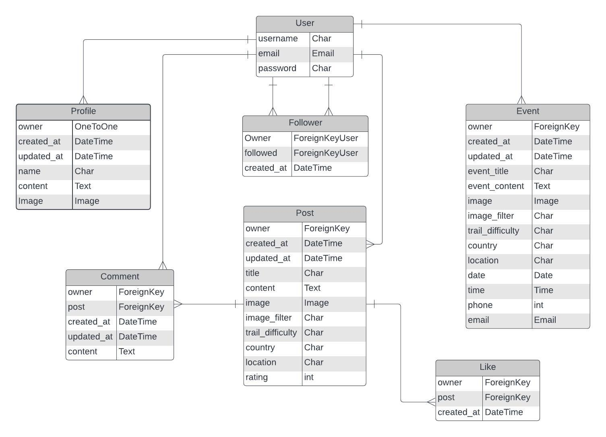

# Outfits API
#
This is the backend api for the outfits Frontend React app. It contains the models and logic to allow the frontend application to perform CRUD operations.

#
* [Deployed Back-End page](https://outfit-backend-797953668660.herokuapp.com/)
* [Deployed Front-End page](https://outfit-ms-4ee7085bae68.herokuapp.com/)
#
## **Contents**
- [**Planning and Project Conception**](#planning-and-project-conception)
	- [**Project Goals**](#project-goals)
	- [**Site Goals**](#site-goals)
	- [**Future Goals**](#future-goals)
	- [**Agile Planning**](#agile-planning)
		- [**GitHub Project Board**](#github-project-board)
		- [**Github Issues**](#github-issues)
		- [**ERD Plan for backend models**](#erd-plan-for-backend-models)
		- [**API Endpoints**](#api-endpoints)
- [**Testing**](#testing)
	- [**Manual Testing**](#manual-testing)
	- [**Test cases**](#test-cases)
	- [**Integration Testing**](#integration-testing)
	- [**Code Validation**](#code-validation)
- [**Bugs**](#bugs)
	- [**Bugs encountered during development**](#bugs-encountered-during-development)
- [**Technologies**](#technologies)
	- [**Languages used**](#languages-used)
	- [**Databases**](#databases)
	- [**Cloud storage and deployment services**](#cloud-storage-and-deployment-services)
	- [**Frameworks, tools and libraries**](#frameworks-tools-and-libraries)
		- [API Back-End](#api-back-end)
		- [REACT Front-End](#react-front-end)
	- [**Installed Libraries and packages**](#installed-libraries-and-packages)
- [**Deployment**](#deployment)
	- [Steps to set up and deploy the project:](#steps-to-set-up-and-deploy-the-project)
		- [**Gitpod**](#gitpod)
		- [**ElephantSQL**](#elephantsql)
		- [**Environemental variables and settings.py**](#environemental-variables-and-settingspy)
		- [**Heroku**](#heroku)
	- [**Connect a Frontend app with the Backend API**](#connect-a-frontend-app-with-the-backend-api)
		- [**API Heroku config vars settings**](#api-heroku-config-vars-settings)
		- [**Axios library**](#axios-library)
		- [**Steps to Fork the repository**](#steps-to-fork-the-repository)
		- [**Steps to clone the repository**](#steps-to-clone-the-repository)
- [**Credits**](#credits)
	- [Code Institute](#code-institute)
	- [Resources for creating the rating field in post model:](#resources-for-creating-the-rating-field-in-post-model)
	- [Bug fixes sources:](#bug-fixes-sources)


## **Planning and Project Conception**
### **Project Goals**

1. To use Django Rest Framework to create RESTful APIs for a Frontend Application.
2. To connect a frontend app to a backend api.

[Back to top](#)

### **Site Goals**
1. To build an API which contains models for frontend features for a social media site.
2. To convert django models into JSON by defining serialisers.
3. To use these models as the architecture for the custom components for the frontend app such as the Post component. 
4. To  set up authentication, permissions and url routing manage access to site features and actions.

### **Future Goals**
- To add the event model to the api to expand the possible features.

[Back to top](#)
#
### **Agile Planning**
#### **GitHub Project Board**

* This project was made using agile methodologies. Epics and user stories.

[Back to top](#)

#### **ERD Plan for backend models**
 * The plan for this project is based on the Code Institute Moments walkthrough project. 
 * Most of the models are the same except for the post model which has been customised to better suit the needs of the site owner and users.
 * Initial plans were to include an event model, but that has been assigned as a future feature to help focus on the minimal viable product of  the site. 



[Back to top](#contents)

#### **API Endpoints**
```
/
dj-rest-auth/login/
dj-rest-auth/logout/
dj-rest-auth/registration/
dj-rest-auth/password/change/
dj-rest-auth/token/refresh/
profiles/
profiles/<int:pk>/
posts/
posts/<int:pk>/
comments/
comments/<int:pk>/
likes/
likes/<int:pk>/
followers/
followers/<int:pk>/
contacts/
contacts/<int:pk>/
reviews/
reviews/<int:pk>/
```
[Back to top](#contents)

## **Testing**
### **Manual Testing**
- The outfits api was tested manually throughout development  using django rest framework. 
- API Endpoints and CRUD functionality was tested for each feature. 
- The API endpoints were also checked in the deployed site to see if they were working and checked throughout the frontend development to ensure front and backend integration.

### **Test cases**
Below are some test cases that were implemented throughout development to check correct functionality: 
- Check login/logout and registration functionality.
- Check that access to post, comments, profiles, followers and likes POST, PUT and DELETE Metods are restricted to authorised users. 
- Get methods are checked via api endpoints.
- Filter function was checked using keywords.
- POST method was tested for Posts, comments, likes, contacts, reviews and followers
- POST method for dj-rest-auth/registration/ to create a profile tested
- POST method for /dj-rest-auth/password/change/ to change password tested
- PUT mehtod for profiles/id, posts/id and comments/id tested
- DELETE method for posts/id, comments/id, likes/id, followers/id tested

[Back to top](#contents)

### **Integration Testing**
The outfits API has also gone through integration testing via testing the features on  the frontend site.

[Back to top](#)

### **Code Validation**
- The python code was monitored for errors and adjusted throughout development using the gitpod IDE problems tab.
- In the final code review, I opened all python files and corrected any problems that were left.
    - Only minor issues like blank line at end of file remained.
- The only issues I did not fix are the line too long warnings from the automatically generated settings.py variable which contains long strings. 
    - I left these strings intact rather than breaking them up into smaller strings for the sake of avoiding potential issues.

[Back to top](#contents)

## **Bugs**
### **Bugs encountered during development**
* The login functionality doesnt work in my phone.

[Back to top](#)
## **Technologies** 
### **Languages used**
- [Python](https://www.python.org/) 

- [HTML](https://www.w3schools.com/html/html_intro.asp)

- [CSS](https://www.w3schools.com/css/css_intro.asp)

- [JS](https://reactjs.org/)

### **Databases**
- [Postgresql](https://www.postgresql.org/)

### **Cloud storage and deployment services**
- [Cloudinary](https://cloudinary.com/)
    - Used to store media files and images.
- [Heroku](https://www.heroku.com/)
    - Used to host the deployed sitewhat
- [ElephantSQL]() 
   - Used to host and operate the PostgresSQL database

[Back to top](#contents)

### **Frameworks, tools and libraries**
#### API Back-End
- [Django Rest Framework](https://www.django-rest-framework.org/)
    - The frmaework used to build the api
- [Psycopg2](https://pypi.org/project/psycopg2/)
   - PostgreSQL database adapter for python
- [django_filters](https://django-filter.readthedocs.io/en/stable/guide/install.html) 
    - Provides filtering capabilities for Django querysets in the API views.
    - In the frontend UI, this will allow users to search with keywords to find relevant content. 
- [dj_rest_auth](https://dj-rest-auth.readthedocs.io/en/latest/installation.html)
    - Extends Django REST Framework's authentication and provides authentication views.
- [rest_framework.authtoken](https://pypi.org/project/django-rest-authtoken/)
    - Provides token-based authentication for the REST Framework.
- [dj_rest_auth.registration](https://dj-rest-auth.readthedocs.io/en/latest/installation.html)
    - Handles user registration views and functionality for dj-rest-auth.
- [allauth](https://django-allauth.readthedocs.io/en/latest/installation.html)
    - Provides user authentication, registration, and account management functionalities.
- [corsheaders](https://pypi.org/project/django-cors-headers/)
    - Handles Cross-Origin Resource Sharing (CORS) headers for handling requests from different origins.
- [JSON WEB tokens](https://django-rest-framework-simplejwt.readthedocs.io/en/latest/getting_started.html)
    - Authenticates requests through a JSON web token provided in a request header.
    - ManageS account authorisation, keep user logged-in for 24 hours.

[Back to top](#contents)

#### REACT Front-End
- [React JS](https://reactjs.org/)
- [JSON Web Tokens](https://jwt.io/)
- [React Bootstrap](https://react-bootstrap-v4.netlify.app/)
- [react-simple-star-rating](https://www.npmjs.com/package/react-simple-star-rating/v/4.0.5)
- [React Router](https://v5.reactrouter.com/web/guides/quick-start)
- [Font Awesome](https://fontawesome.com/)
- [Canva](https://www.canva.com/)
- [Favicon.io](https://favicon.io/favicon-converter/)
- [Schemecolor](https://www.schemecolor.com/)
- [Pixabay](https://pixabay.com/)
- [Google fonts](https://fonts.google.com/)
- [Markdown TOC generator](https://magnetikonline.github.io/markdown-toc-generate/)

### **Installed Libraries and packages**
The following libraries and packages were installed using the pip3 install command:
```
'django<4'
dj3-cloudinary-storage
Pillow
djangorestframework
django-filter
dj-rest-auth
'dj-rest-auth[with_social]'
djangorestframework-simplejwt
dj_database_url psycopg2
gunicorn
django-cors-headers
```
[Back to top](#)

## **Deployment**
### Steps to set up and deploy the project:
#### **Gitpod**
This project was created using the Code Institute Gitpod Full 
Template. Below are the steps that were followed for the set up
1. Create a repository in github using the [Code Institute template](https://github.com/Code-Institute-Org/gitpod-full-template). 
2. Click Use this Template and add a repository name.
3. Click Create Repository from template
4. Install Django and the rest of the libraries listed in the libraries section. 
5. Freeze requirements using: pip3 freeze --local > requirements.txt
6. To create the project:(django-admin startproject trekkers .  )
    - Note the '.' at the end to ensure we don't need to cd into the app every time.
7. To create the apps: (python3 manage.py startapp posts)
8. Add apps to INSALLED_APPS.
9. Migrate changes and run server locally to check it's working.

[Back to top](#contents)
#
#### **ElephantSQL**
Before deploying to heroku, an external database was created to host the app data.
1. Create an [ElephantSQL](https://www.elephantsql.com/) account. Code Institute provides the steps to do that [here](https://code-institute-students.github.io/deployment-docs/02-elephantsql/elephantsql-01-sign-up).
2. Click the green "Create New Instance" button.
3. Set your plan to Tiny Turtle (Free) and give it a name.
4. Select a data centre near you and click review.
5. Check the details are correct and click create instance.
6. Return to the ElephantSQL dashboard and select the newly created database instance.
7. Copy the database URL using the copy icon. 
8. Add this database url to your env file.
9. Later you will also add this url to your Heroku Config Vars.

[Back to top](#contents)
#

#### **Environemental variables and settings.py**
1. Create the env.py file in the top level directory.
2. Import os library and set the variables accordingly: 
    - The database is your ElephantSQL URL
    - The secret key you can make up or use a [generator](https://djecrety.ir/)
    - I am using cloudinary for image storage so the cloudinary url is my API Environmental variable for my cloudinary account. 
    
env.py for this project: 

```
import os

os.environ['CLOUDINARY_URL'] = 'cloudinary://thisisasecret'
os.environ['DEV'] = '1'
os.environ['SECRET_KEY'] = 'thisisasecret'
os.environ['DATABASE_URL'] = 'postgres://thisisasecret'
```

[Back to top](#contents)

3. In settings.py, make sure to import dj-database, regular expression and os modules and  use an if statement to get the env.py file.

```
    import dj_database_url
    import re
    import os
    if os.path.exists('env.py')
        import env
```

4. Remove the automtic django secret key and get it from the env.py.
```
SECRET_KEY = os.environ.get('SECRET_KEY')
```
5. Comment out the old DataBase section and replace it with the one below.
```
    if 'DEV' in os.environ:
        DATABASES = {
            'default': {
                'ENGINE': 'django.db.backends.sqlite3',
                'NAME': BASE_DIR / 'db.sqlite3',
            }
        }
    else:
        DATABASES = {
            'default': dj_database_url.parse(os.environ.get("DATABASE_URL"))
        }
```

[Back to top](#contents)

6. Set up Cloudinary to store the static and media files.
7. Add `'cloudinary_storage',` to INSTALLED_APPS, in settings.py, above `'django.contrib.staticfiles',`.
8. Then add `'cloudinary',` underneath  'django.contrib.staticfiles',.
     - NB. The order is important:
     ```
        'cloudinary_storage',
        'django.contrib.staticfiles',
        'cloudinary',
     ```
9. In settings.py, add the code to tell Django to use cloudinary to store media and static files. 
    ```
        CLOUDINARY_STORAGE = {
        'CLOUDINARY_URL': os.environ.get('CLOUDINARY_URL')
        }
        MEDIA_URL = '/media/'
        DEFAULT_FILE_STORAGE = 'cloudinary_storage.storage.MediaCloudinaryStorage'

    ```
[Back to top](#contents)

10. Below INSTALLED_APPS, set site ID:
```
    SITE_ID = 1
```
11. Below BASE_DIR, create the REST_FRAMEWORK variable and include page pagination to improve app loading times, pagination count, and date/time format:
```
    REST_FRAMEWORK = {
        'DEFAULT_AUTHENTICATION_CLASSES': [(
            'rest_framework.authentication.SessionAuthentication'
            if 'DEV' in os.environ
            else 'dj_rest_auth.jwt_auth.JWTCookieAuthentication'
        )],
        'DEFAULT_PAGINATION_CLASS':
            'rest_framework.pagination.PageNumberPagination',
        'PAGE_SIZE': 10,
        'DATETIME_FORMAT': '%d %b %Y',
    }
```
12. Set the default renderer to JSON:
```
if 'DEV' not in os.environ:
    REST_FRAMEWORK['DEFAULT_RENDERER_CLASSES'] = [
        'rest_framework.renderers.JSONRenderer',
    ]
```
[Back to top](#contents)

13. Beneath that, add the following:
```
REST_USE_JWT = True
JWT_AUTH_SECURE = True
JWT_AUTH_COOKIE = 'my-app-auth'
JWT_AUTH_REFRESH_COOKIE = 'my-refresh-token'
JWT_AUTH_SAMESITE = 'None'
```
14. Then add the variable to configure the serializer class to be used for serializing the user details for the current user:
```
    REST_AUTH_SERIALIZERS = {
        'USER_DETAILS_SERIALIZER': 'trekkers.serializers.CurrentUserSerializer'
    }
```
15. Update DEBUG variable so that it is false by default unless 'DEV' exitss, in which case get the boolean value from env.py:
```
    DEBUG = 'DEV' in os.environ
```
[Back to top](#contents)

16. Update the DATABASES variable to a conditional to either use SQLITE database for development or the ElephantSQL database url from the env file otherwise:
```
if 'DEV' in os.environ:
    DATABASES = {
        'default': {
             'ENGINE': 'django.db.backends.sqlite3',
             'NAME': BASE_DIR / 'db.sqlite3',
         }
     }
else:
    DATABASES = {
        'default': dj_database_url.parse(os.environ.get("DATABASE_URL"))
    }
```
17. Get the heroku url from the ALLOWED_HOSTS variable in env file and allow localhost for development:
- If you have problem running the api with localhost, just replace it with your local browser url.
    - NB: localhost is not working for me so I used the gitpod url.
```

ALLOWED_HOSTS = [
   os.environ.get('ALLOWED_HOST'),
   'localhost',
]
```
[Back to top](#contents)

18. Add the CORS_ALLOWED variable so that we can connect our frontend app using the CLIENT_ORIGIN and CLIENT_ORIGIN_DEV keys in heroku:
```
    if 'CLIENT_ORIGIN' in os.environ:
        CORS_ALLOWED_ORIGINS = [
            os.environ.get('CLIENT_ORIGIN')
        ]

    if 'CLIENT_ORIGIN_DEV' in os.environ:
        extracted_url = re.match(r'^.+-', os.environ.get('CLIENT_ORIGIN_DEV', ''), re.IGNORECASE).group(0)
        CORS_ALLOWED_ORIGIN_REGEXES = [
            rf"{extracted_url}(eu|us)\d+\w\.gitpod\.io$",
        ]
```
19. Also add to the top of MIDDLEWARE:
```
    'corsheaders.middleware.CorsMiddleware',
```
20. Ensure all third party packages and custom apps have been added to INSTALLED_APPS:
```
    INSTALLED_APPS = [
        'django.contrib.admin',
        'django.contrib.auth',
        'django.contrib.contenttypes',
        'django.contrib.sessions',
        'django.contrib.messages',
        'cloudinary_storage',
        'django.contrib.staticfiles',
        'cloudinary',
        'rest_framework',
        'django_filters',
        'rest_framework.authtoken',
        'dj_rest_auth',
        'django.contrib.sites',
        'allauth',
        'allauth.account',
        'allauth.socialaccount',
        'dj_rest_auth.registration',
        'corsheaders',

        'profiles',
        'posts',
        'comments',
        'likes',
        'followers',
    ]

```
[Back to top](#contents)

21. Create a Procfile and add web:
```
    release: python manage.py makemigrations && python manage.py migrate
    web: gunicorn trekkers.wsgi
```
22. Make sure to freeze all requirements: 
```
    pip3 freeze --local > requirements.txt
```
23. Check all migrations have been made:
```
    python3 manage.py makemigrations
    python3 manage.py migrate
```
24. Git add, commit and push.
25. App is ready for deployment to heroku. 

[Back to top](#contents) 
#

#### **Heroku**
Initial deployment to heroku was done early with the intention of making the final deployment process more smooth.
1. Log in to [Heroku](https://www.heroku.com/).
2. From the dashboard, click the button labelled "New" in the top right corner and from the drop-down menu select Create New App.
3. Enter a name for the app and select your region.
4. Click Create App.                  
5. Find the Settings Tab and scroll down to Config Vars.
6. Click Reveal Config Vars.
7. Enter the following key-value pairs:
    - Key: SECRET_KEY | Value: YourSecreteKeyValue
    - Key: CLOUDINARY_URL | Value: cloudinary://yourCloudinaryAPIenv
    - Key: DATABASE_URL | Value: postgres://yourElephantSQLDatabasUrl
    - Key: DISABLE_COLLECTSTATIC | Value: 1
    - Key: ALLOWED_HOST | Value: pp5-trekkers-api.herokuapp.com
- For final deployment remove DISABLE_COLLECTSTATIC from congif vars.
8. Navigate to the Deployment tab and choose Github as the deployment method.
9. Search for the repo name and connect to the correct repository.
10. Scroll down and deploy branch.
11. Finally click the open app button once the build is finished.

[Back to top](#contents)

### **Connect a Frontend app with the Backend API**

#### **API Heroku config vars settings**
- In order to connect not only the deployed Frontend app but also the development version of the app, we need to provide both heroku and local urls to the API via the api's heroku congif vars.
- This was done using the following steps: 
1. Navigate to the deployed Backend api on heroku and go to the "Settings" tab.
2. Set two new Config Vars.

[Back to top](#contents)

#### **Axios library**
- Next we need to tell the Frontend app where to send HTTP requests to.
- This was done using the Axios library using the following steps: 
1. Install the Axios library : npm install axios.
2. Create an api folder inside the src folder and inside create an axiosDefaults.js file. 
3. Set the baseURL to the deployed api, and set the content type and Credentials.
4. Import it in App.js.

[Back to top](#contents)


## **Credits**
### Code Institute

This project is a variation and laregely based on the [Code Institute Moments](https://github.com/Code-Institute-Solutions/drf-api/tree/ed54af9450e64d71bc4ecf16af0c35d00829a106) walkthrough project.
It contains models and logic from that project which have bee modified for the prupose of this one.

### Resources for creating the rating field in post model:
1.	Geeksforgeeks: [Posititive Integer field](https://www.geeksforgeeks.org/positiveintegerfield-django-models/)


